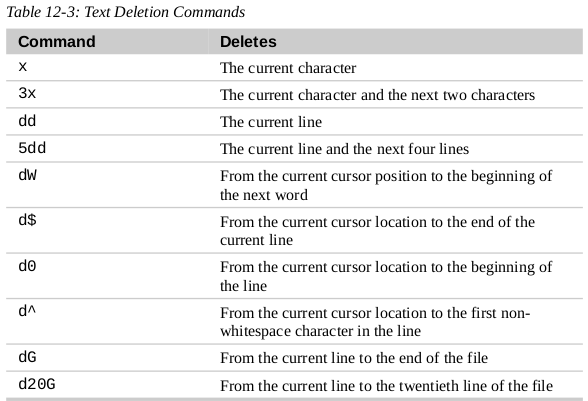

# Vim - The Text Editor

1. Create a new file 

        $ vim test.txt

2. Press `[i]` key on your keyboard to enter **INSERT** mode

3. Copy the following text

    ```
    What is Lorem Ipsum?
    Lorem Ipsum is simply dummy text of the printing and typesetting industry. Lorem Ipsum has been the industry's standard dummy text ever since the 1500s, when an unknown printer took a galley of type and scrambled it to make a type specimen book. It has survived not only five centuries, but also the leap into electronic typesetting, remaining essentially unchanged. It was popularised in the 1960s with the release of Letraset sheets containing Lorem Ipsum passages, and more recently with desktop publishing software like Aldus PageMaker including versions of Lorem Ipsum.
    
    Why do we use it?
    It is a long established fact that a reader will be distracted by the readable content of a page when looking at its layout. The point of using Lorem Ipsum is that it has a more-or-less normal distribution of letters, as opposed to using 'Content here, content here', making it look like readable English. Many desktop publishing packages and web page editors now use Lorem Ipsum as their default model text, and a search for 'lorem ipsum' will uncover many web sites still in their infancy. Various versions have evolved over the years, sometimes by accident, sometimes on purpose (injected humour and the like).
    ```

4. Go to *Vim* editor, and press `[Ctrl] + [Shift] + [v]` key combination to paste the copied text

    

5. Press `[Esc]` key to enter *command mode*
6. Type `:wq` and press `[Enter]` key to **write** and **quit**
7. Open the file again

        $ vim test.txt

8. Press `[v]` key to enter *visual character* mode. The word **VISUAL** will appear at the bottom of the screen.
9.  Use the **Arrow** keys to highlight the desired text. You can use other navigation commands, such as `[w]` to **highlight** until the beginning of the next word or `[$]` to include the rest of the line.
10. Once the text is highlighted, press `[d]` key to **delete** the text, or press `[c]` key to **change** the highlighted text
11. If you deleted too much or not enough, press `[u]` key to **undo** and start again.
12. To **redo** changes which were undone, press `[Ctrl] + [r]` key combination
13. Repeat step #5 (above)
14. Type `:q!` and press `[Enter]` key to **force quit** without saving the changes
15. Repeat step #7 (above)
16. Search for the term `Lorem` (case-sensitive), and replace all occurrences with the text `FOUND LOREM` by typing following command in *Vim* editor

        :%s/Lorem/FOUND LOREM/gcI

17. Open a **new terminal** in a *split window* by typing the command `:term`

    

18. Access **shell** by typing the command `:!bash`

    
    

    *Note:* Type `exit` command to exit the shell and return to *Vim* text editor  

19. Global search and **replace**: 
    
        :%s/Line/line/g
        :%s/Line/line/gc

20. Edit **multiple** files

        vi foo.txt foo1.txt
        :bn
        :bp
        :buffers
        :buffer 1

    **Add** a new file

        :e foo3.txt

    **Insert** an etire file into another

        :r foo4.txt

    **Save** the edited file with a different name

        :w foo5.txt

    In command mode, typing **ZZ** will save the current file and exit vi.

## Cursor Movement Keys

`

## Text Deletion Commands



## References

* https://www.youtube.com/watch?v=UIwcTU10F5k
* https://opensource.com/article/19/2/getting-started-vim-visual-mode
* http://vimregex.com/

## Resources

* http://linuxcommand.org/lc3_adv_vimvigor.php
* ftp://ftp.vim.org/pub/vim/doc/book/vimbook-OPL.pdf
* https://tldp.org/HOWTO/Bash-Prompt-HOWTO/